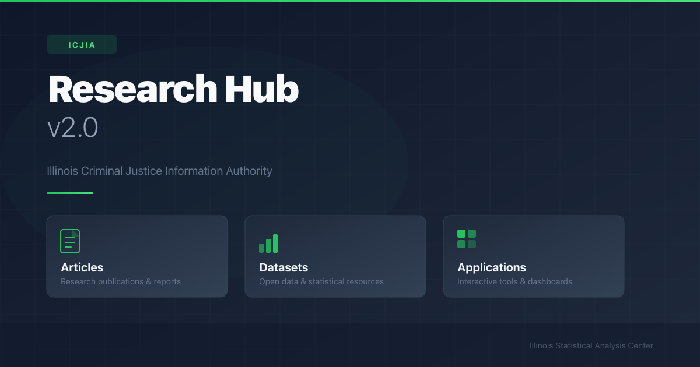

# ICJIA Research Hub v2.0 — Frontend



[](https://ui.nuxt.com)

The frontend for the ICJIA Research Hub version 2.0, built with [Nuxt 4](https://nuxt.com) and [Nuxt UI](https://ui.nuxt.com). Deployed as a statically generated site on Netlify. Includes pre-configured SEO with Open Graph and Twitter Card meta tags via Nuxt's `useSeoMeta()`.

- [Hub 2.0 development site](https://v2hub.netlify.app/)

## Tech Stack

| Technology | Version | Description |
|---|---|---|
| [Nuxt](https://nuxt.com) | 4.x | Vue-based full-stack framework |
| [Vue](https://vuejs.org) | 3.x | Reactive UI framework (bundled with Nuxt) |
| [Nuxt UI](https://ui.nuxt.com) | 4.x | Component library for Nuxt |
| [Nuxt Content](https://content.nuxt.com) | 3.x | File-based CMS module |
| [Tailwind CSS](https://tailwindcss.com) | 4.x | Utility-first CSS framework |
| [TypeScript](https://www.typescriptlang.org) | 5.x | Type-safe JavaScript |
| [ESLint](https://eslint.org) | 10.x | Code linting |
| [pnpm](https://pnpm.io) | 10.x | Fast, disk-efficient package manager |
| [Iconify](https://iconify.design) | — | Icon sets (Lucide, Simple Icons) |
| [Nuxt A11y](https://github.com/nuxt/a11y) | 1.0.0-alpha | Accessibility auditing module |
| [Netlify](https://www.netlify.com) | — | Static site hosting (Nitro `static` preset) |

## About the Research & Analysis Unit

The Research & Analysis Unit serves as Illinois' Statistical Analysis Center (SAC). State SACs provide objective analysis of criminal justice data for informing statewide policy and practice. The Illinois SAC is affiliated with and supported by the Justice Information Resource Network (JIRN), a national nonprofit organization that promotes collaboration and exchange of information among state SACs, and acts as a liaison between state agencies and the U.S. Department of Justice.

R&A has taken a leadership role in convening policymakers and practitioners to coordinate and improve system response to crime and to promote the use of evidence-based and promising practices at the state and local level. The unit staffs statutorily created criminal justice initiatives. It also develops statistical methodologies and provides statistical advice and interpretation to support criminal justice decision-making and information needs.

## Setup

Make sure to install the dependencies:

```bash
pnpm install
```

## Development Server

Start the development server on `http://localhost:3000`:

```bash
pnpm dev
```

## Production

Build the application for production:

```bash
pnpm build
```

Locally preview production build:

```bash
pnpm preview
```

Check out the [deployment documentation](https://nuxt.com/docs/getting-started/deployment) for more information.
